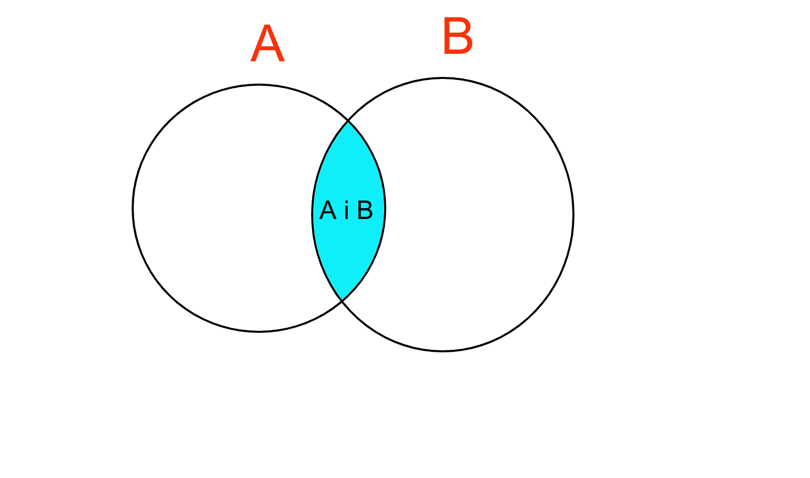
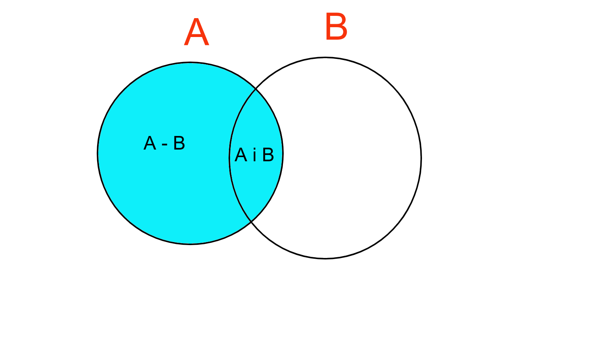
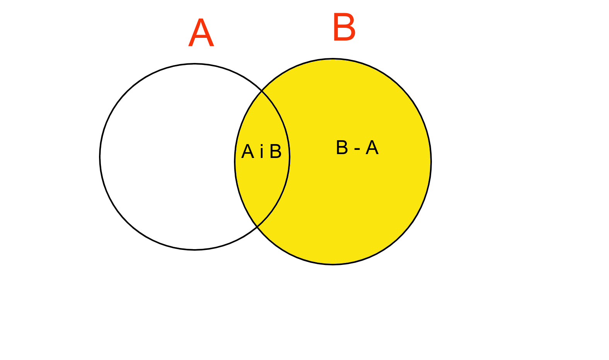
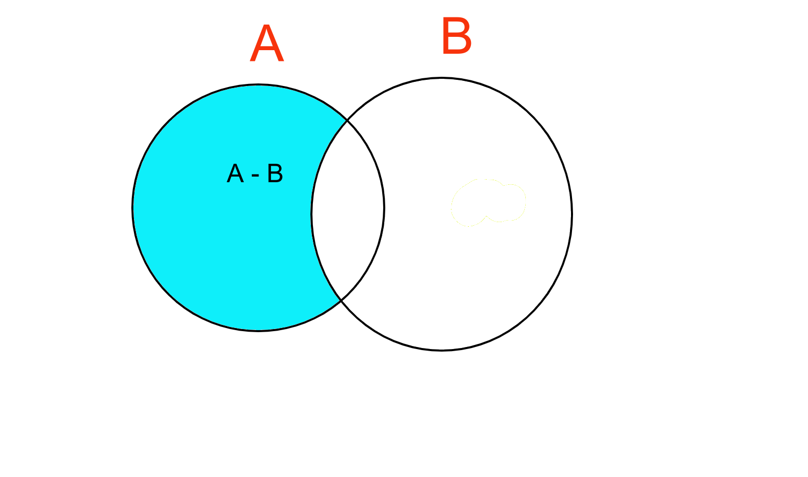
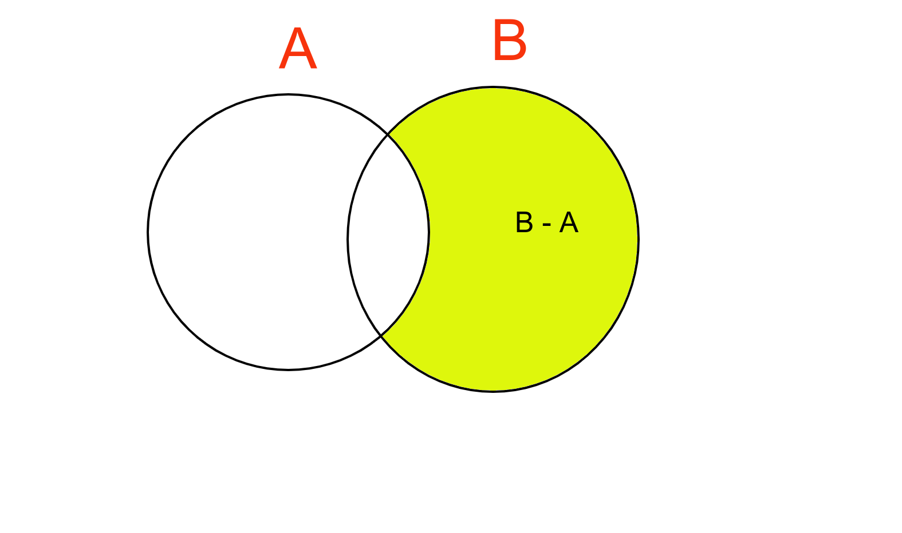
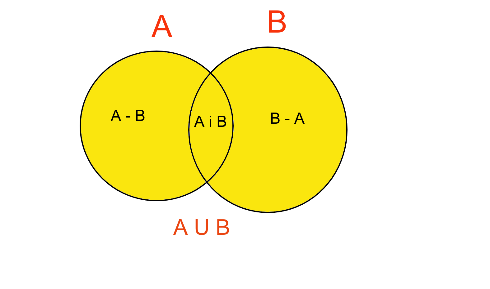
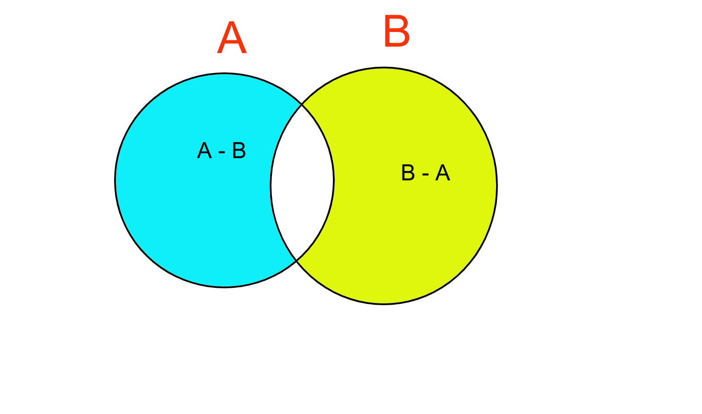

## MySQL JOINS

**Author: Abhishek Dey**

**Last Modified : July 6, 2024**

## SQL JOINS - BY EXAMPLE QUERIES

<p align="left">

</p>


## Movies Database


* Show databases;

```
mysql> show databases;
+--------------------+
| Database           |
+--------------------+
| information_schema |
| moviesdb           |
| mysql              |
| performance_schema |
| sys                |
| world              |
+--------------------+
6 rows in set (0.00 sec)

mysql> 

```

* Use moviesdb

```

mysql> 
mysql> use moviesdb;
Database changed
mysql>

```

* Show tables

```

mysql> show tables;
+--------------------+
| Tables_in_moviesdb |
+--------------------+
| actors             |
| financials         |
| languages          |
| movie_actor        |
| movies             |
+--------------------+
5 rows in set (0.00 sec)

mysql>

```

* Fields in movies table **[ TABLE A]**

```

mysql> describe movies;
+--------------+------------------+------+-----+---------+----------------+
| Field        | Type             | Null | Key | Default | Extra          |
+--------------+------------------+------+-----+---------+----------------+
| movie_id     | int unsigned     | NO   | PRI | NULL    | auto_increment |
| title        | varchar(150)     | NO   |     | NULL    |                |
| industry     | varchar(45)      | YES  |     | NULL    |                |
| release_year | year             | YES  |     | NULL    |                |
| imdb_rating  | decimal(3,1)     | YES  |     | NULL    |                |
| studio       | varchar(45)      | YES  |     | NULL    |                |
| language_id  | tinyint unsigned | YES  | MUL | NULL    |                |
+--------------+------------------+------+-----+---------+----------------+
7 rows in set (0.00 sec)

mysql> 

```

* Fields in financials table **[TABLE B]**

```
mysql> describe financials;
+----------+-------------------------------------------------+------+-----+---------+-------+
| Field    | Type                                            | Null | Key | Default | Extra |
+----------+-------------------------------------------------+------+-----+---------+-------+
| movie_id | int unsigned                                    | NO   | PRI | NULL    |       |
| budget   | decimal(10,2)                                   | YES  |     | NULL    |       |
| revenue  | decimal(10,2)                                   | YES  |     | NULL    |       |
| unit     | enum('Units','Thousands','Millions','Billions') | YES  |     | NULL    |       |
| currency | char(3)                                         | YES  |     | NULL    |       |
+----------+-------------------------------------------------+------+-----+---------+-------+
5 rows in set (0.00 sec)

mysql> 


```

## Inner Join

<p align="left">

</p>

```
mysql> select A.movie_id, title, budget, revenue from movies A 
    -> INNER JOIN financials B
    -> ON A.movie_id=B.movie_id;

```

```
+----------+---------------------------------------------+----------+-----------+
| movie_id | title                                       | budget   | revenue   |
+----------+---------------------------------------------+----------+-----------+
|      101 | K.G.F: Chapter 2                            |     1.00 |     12.50 |
|      102 | Doctor Strange in the Multiverse of Madness |   200.00 |    954.80 |
|      103 | Thor: The Dark World                        |   165.00 |    644.80 |
|      104 | Thor: Ragnarok                              |   180.00 |    854.00 |
|      105 | Thor: Love and Thunder                      |   250.00 |    670.00 |
|      107 | Dilwale Dulhania Le Jayenge                 |   400.00 |   2000.00 |
|      108 | 3 Idiots                                    |   550.00 |   4000.00 |
|      109 | Kabhi Khushi Kabhie Gham                    |   390.00 |   1360.00 |
|      110 | Bajirao Mastani                             |     1.40 |      3.50 |
|      111 | The Shawshank Redemption                    |    25.00 |     73.30 |
|      113 | Interstellar                                |   165.00 |    701.80 |
|      115 | The Pursuit of Happyness                    |    55.00 |    307.10 |
|      116 | Gladiator                                   |   103.00 |    460.50 |
|      117 | Titanic                                     |   200.00 |   2202.00 |
|      118 | It's a Wonderful Life                       |     3.18 |      3.30 |
|      119 | Avatar                                      |   237.00 |   2847.00 |
|      120 | The Godfather                               |     7.20 |    291.00 |
|      121 | The Dark Knight                             |   185.00 |   1006.00 |
|      122 | Schindler's List                            |    22.00 |    322.20 |
|      123 | Jurassic Park                               |    63.00 |   1046.00 |
|      124 | Parasite                                    |    15.50 |    263.10 |
|      125 | Avengers: Endgame                           |   400.00 |   2798.00 |
|      126 | Avengers: Infinity War                      |   400.00 |   2048.00 |
|      127 | Pather Panchali                             | 70000.00 | 100000.00 |
|      128 | Taare Zameen Par                            |   120.00 |   1350.00 |
|      129 | Munna Bhai M.B.B.S.                         |   100.00 |    410.00 |
|      130 | PK                                          |   850.00 |   8540.00 |
|      131 | Sanju                                       |     1.00 |      5.90 |
|      132 | Pushpa: The Rise - Part 1                   |     2.00 |      3.60 |
|      133 | RRR                                         |     5.50 |     12.00 |
|      134 | Baahubali: The Beginning                    |     1.80 |      6.50 |
|      135 | The Kashmir Files                           |   250.00 |   3409.00 |
|      136 | Bajrangi Bhaijaan                           |   900.00 |  11690.00 |
|      137 | Captain America: The First Avenger          |   216.70 |    370.60 |
|      138 | Captain America: The Winter Soldier         |   177.00 |    714.40 |
|      139 | Race 3                                      |     1.80 |      3.10 |
|      140 | Shershaah                                   |   500.00 |    950.00 |
+----------+---------------------------------------------+----------+-----------+
37 rows in set (0.00 sec)

```

## Left Join

<p align="left">

</p>


```

mysql> select A.movie_id, title, budget, revenue from movies A 
    -> LEFT JOIN financials B
    -> ON A.movie_id=B.movie_id;
    
```

```

+----------+---------------------------------------------+----------+-----------+
| movie_id | title                                       | budget   | revenue   |
+----------+---------------------------------------------+----------+-----------+
|      101 | K.G.F: Chapter 2                            |     1.00 |     12.50 |
|      102 | Doctor Strange in the Multiverse of Madness |   200.00 |    954.80 |
|      103 | Thor: The Dark World                        |   165.00 |    644.80 |
|      104 | Thor: Ragnarok                              |   180.00 |    854.00 |
|      105 | Thor: Love and Thunder                      |   250.00 |    670.00 |
|      106 | Sholay                                      |     NULL |      NULL |
|      107 | Dilwale Dulhania Le Jayenge                 |   400.00 |   2000.00 |
|      108 | 3 Idiots                                    |   550.00 |   4000.00 |
|      109 | Kabhi Khushi Kabhie Gham                    |   390.00 |   1360.00 |
|      110 | Bajirao Mastani                             |     1.40 |      3.50 |
|      111 | The Shawshank Redemption                    |    25.00 |     73.30 |
|      112 | Inception                                   |     NULL |      NULL |
|      113 | Interstellar                                |   165.00 |    701.80 |
|      115 | The Pursuit of Happyness                    |    55.00 |    307.10 |
|      116 | Gladiator                                   |   103.00 |    460.50 |
|      117 | Titanic                                     |   200.00 |   2202.00 |
|      118 | It's a Wonderful Life                       |     3.18 |      3.30 |
|      119 | Avatar                                      |   237.00 |   2847.00 |
|      120 | The Godfather                               |     7.20 |    291.00 |
|      121 | The Dark Knight                             |   185.00 |   1006.00 |
|      122 | Schindler's List                            |    22.00 |    322.20 |
|      123 | Jurassic Park                               |    63.00 |   1046.00 |
|      124 | Parasite                                    |    15.50 |    263.10 |
|      125 | Avengers: Endgame                           |   400.00 |   2798.00 |
|      126 | Avengers: Infinity War                      |   400.00 |   2048.00 |
|      127 | Pather Panchali                             | 70000.00 | 100000.00 |
|      128 | Taare Zameen Par                            |   120.00 |   1350.00 |
|      129 | Munna Bhai M.B.B.S.                         |   100.00 |    410.00 |
|      130 | PK                                          |   850.00 |   8540.00 |
|      131 | Sanju                                       |     1.00 |      5.90 |
|      132 | Pushpa: The Rise - Part 1                   |     2.00 |      3.60 |
|      133 | RRR                                         |     5.50 |     12.00 |
|      134 | Baahubali: The Beginning                    |     1.80 |      6.50 |
|      135 | The Kashmir Files                           |   250.00 |   3409.00 |
|      136 | Bajrangi Bhaijaan                           |   900.00 |  11690.00 |
|      137 | Captain America: The First Avenger          |   216.70 |    370.60 |
|      138 | Captain America: The Winter Soldier         |   177.00 |    714.40 |
|      139 | Race 3                                      |     1.80 |      3.10 |
|      140 | Shershaah                                   |   500.00 |    950.00 |
+----------+---------------------------------------------+----------+-----------+
39 rows in set (0.00 sec)


```    


## Right Join


<p align="left">

</p>


```
mysql> select B.movie_id, title, budget, revenue from movies A
    -> RIGHT JOIN financials B
    -> ON A.movie_id=B.movie_id;

```

```
+----------+---------------------------------------------+----------+-----------+
| movie_id | title                                       | budget   | revenue   |
+----------+---------------------------------------------+----------+-----------+
|      101 | K.G.F: Chapter 2                            |     1.00 |     12.50 |
|      102 | Doctor Strange in the Multiverse of Madness |   200.00 |    954.80 |
|      103 | Thor: The Dark World                        |   165.00 |    644.80 |
|      104 | Thor: Ragnarok                              |   180.00 |    854.00 |
|      105 | Thor: Love and Thunder                      |   250.00 |    670.00 |
|      107 | Dilwale Dulhania Le Jayenge                 |   400.00 |   2000.00 |
|      108 | 3 Idiots                                    |   550.00 |   4000.00 |
|      109 | Kabhi Khushi Kabhie Gham                    |   390.00 |   1360.00 |
|      110 | Bajirao Mastani                             |     1.40 |      3.50 |
|      111 | The Shawshank Redemption                    |    25.00 |     73.30 |
|      113 | Interstellar                                |   165.00 |    701.80 |
|      114 | NULL                                        |   205.00 |    365.30 |
|      115 | The Pursuit of Happyness                    |    55.00 |    307.10 |
|      116 | Gladiator                                   |   103.00 |    460.50 |
|      117 | Titanic                                     |   200.00 |   2202.00 |
|      118 | It's a Wonderful Life                       |     3.18 |      3.30 |
|      119 | Avatar                                      |   237.00 |   2847.00 |
|      120 | The Godfather                               |     7.20 |    291.00 |
|      121 | The Dark Knight                             |   185.00 |   1006.00 |
|      122 | Schindler's List                            |    22.00 |    322.20 |
|      123 | Jurassic Park                               |    63.00 |   1046.00 |
|      124 | Parasite                                    |    15.50 |    263.10 |
|      125 | Avengers: Endgame                           |   400.00 |   2798.00 |
|      126 | Avengers: Infinity War                      |   400.00 |   2048.00 |
|      127 | Pather Panchali                             | 70000.00 | 100000.00 |
|      128 | Taare Zameen Par                            |   120.00 |   1350.00 |
|      129 | Munna Bhai M.B.B.S.                         |   100.00 |    410.00 |
|      130 | PK                                          |   850.00 |   8540.00 |
|      131 | Sanju                                       |     1.00 |      5.90 |
|      132 | Pushpa: The Rise - Part 1                   |     2.00 |      3.60 |
|      133 | RRR                                         |     5.50 |     12.00 |
|      134 | Baahubali: The Beginning                    |     1.80 |      6.50 |
|      135 | The Kashmir Files                           |   250.00 |   3409.00 |
|      136 | Bajrangi Bhaijaan                           |   900.00 |  11690.00 |
|      137 | Captain America: The First Avenger          |   216.70 |    370.60 |
|      138 | Captain America: The Winter Soldier         |   177.00 |    714.40 |
|      139 | Race 3                                      |     1.80 |      3.10 |
|      140 | Shershaah                                   |   500.00 |    950.00 |
|      406 | NULL                                        |    30.00 |    350.00 |
|      412 | NULL                                        |   160.00 |    836.80 |
+----------+---------------------------------------------+----------+-----------+
40 rows in set (0.00 sec)

mysql> 


```

## Left Join excluding Inner Join


<p align="left">

</p>


```

mysql> select A.movie_id, title, budget, revenue from movies A 
    -> LEFT JOIN financials B
    -> ON A.movie_id=B.movie_id
    -> WHERE B.movie_id IS NULL;


```

```
+----------+-----------+--------+---------+
| movie_id | title     | budget | revenue |
+----------+-----------+--------+---------+
|      106 | Sholay    |   NULL |    NULL |
|      112 | Inception |   NULL |    NULL |
+----------+-----------+--------+---------+
2 rows in set (0.00 sec)

mysql> 


```

## Right Join excluding Inner Join


<p align="left">

</p>


```
mysql> select B.movie_id, title, budget, revenue from movies A 
    -> RIGHT JOIN financials B
    -> ON A.movie_id=B.movie_id
    -> WHERE A.movie_id IS NULL;

```

```

+----------+-------+--------+---------+
| movie_id | title | budget | revenue |
+----------+-------+--------+---------+
|      114 | NULL  | 205.00 |  365.30 |
|      406 | NULL  |  30.00 |  350.00 |
|      412 | NULL  | 160.00 |  836.80 |
+----------+-------+--------+---------+
3 rows in set (0.00 sec)

mysql> 

```
## Full Outer Join

<p align="left">

</p>

```

mysql> select A.movie_id, title, budget, revenue from movies A 
    -> LEFT JOIN financials B
    -> ON A.movie_id=B.movie_id
    -> UNION
    -> select B.movie_id, title, budget, revenue from movies A
    -> RIGHT JOIN financials B
    -> ON A.movie_id=B.movie_id;

```

```
+----------+---------------------------------------------+----------+-----------+
| movie_id | title                                       | budget   | revenue   |
+----------+---------------------------------------------+----------+-----------+
|      101 | K.G.F: Chapter 2                            |     1.00 |     12.50 |
|      102 | Doctor Strange in the Multiverse of Madness |   200.00 |    954.80 |
|      103 | Thor: The Dark World                        |   165.00 |    644.80 |
|      104 | Thor: Ragnarok                              |   180.00 |    854.00 |
|      105 | Thor: Love and Thunder                      |   250.00 |    670.00 |
|      106 | Sholay                                      |     NULL |      NULL |
|      107 | Dilwale Dulhania Le Jayenge                 |   400.00 |   2000.00 |
|      108 | 3 Idiots                                    |   550.00 |   4000.00 |
|      109 | Kabhi Khushi Kabhie Gham                    |   390.00 |   1360.00 |
|      110 | Bajirao Mastani                             |     1.40 |      3.50 |
|      111 | The Shawshank Redemption                    |    25.00 |     73.30 |
|      112 | Inception                                   |     NULL |      NULL |
|      113 | Interstellar                                |   165.00 |    701.80 |
|      115 | The Pursuit of Happyness                    |    55.00 |    307.10 |
|      116 | Gladiator                                   |   103.00 |    460.50 |
|      117 | Titanic                                     |   200.00 |   2202.00 |
|      118 | It's a Wonderful Life                       |     3.18 |      3.30 |
|      119 | Avatar                                      |   237.00 |   2847.00 |
|      120 | The Godfather                               |     7.20 |    291.00 |
|      121 | The Dark Knight                             |   185.00 |   1006.00 |
|      122 | Schindler's List                            |    22.00 |    322.20 |
|      123 | Jurassic Park                               |    63.00 |   1046.00 |
|      124 | Parasite                                    |    15.50 |    263.10 |
|      125 | Avengers: Endgame                           |   400.00 |   2798.00 |
|      126 | Avengers: Infinity War                      |   400.00 |   2048.00 |
|      127 | Pather Panchali                             | 70000.00 | 100000.00 |
|      128 | Taare Zameen Par                            |   120.00 |   1350.00 |
|      129 | Munna Bhai M.B.B.S.                         |   100.00 |    410.00 |
|      130 | PK                                          |   850.00 |   8540.00 |
|      131 | Sanju                                       |     1.00 |      5.90 |
|      132 | Pushpa: The Rise - Part 1                   |     2.00 |      3.60 |
|      133 | RRR                                         |     5.50 |     12.00 |
|      134 | Baahubali: The Beginning                    |     1.80 |      6.50 |
|      135 | The Kashmir Files                           |   250.00 |   3409.00 |
|      136 | Bajrangi Bhaijaan                           |   900.00 |  11690.00 |
|      137 | Captain America: The First Avenger          |   216.70 |    370.60 |
|      138 | Captain America: The Winter Soldier         |   177.00 |    714.40 |
|      139 | Race 3                                      |     1.80 |      3.10 |
|      140 | Shershaah                                   |   500.00 |    950.00 |
|      114 | NULL                                        |   205.00 |    365.30 |
|      406 | NULL                                        |    30.00 |    350.00 |
|      412 | NULL                                        |   160.00 |    836.80 |
+----------+---------------------------------------------+----------+-----------+
42 rows in set (0.03 sec)

```


## Full Outer Join excluding inner join

<p align="left">

</p>
  

```

mysql> select A.movie_id, title, budget, revenue from movies A 
    -> LEFT JOIN financials B
    -> ON A.movie_id=B.movie_id
    -> UNION
    -> select B.movie_id, title, budget, revenue from movies A
    -> RIGHT JOIN financials B
    -> ON A.movie_id=B.movie_id
    -> WHERE A.movie_id or B.movie_id IS NULL;

```

```
+----------+---------------------------------------------+----------+-----------+
| movie_id | title                                       | budget   | revenue   |
+----------+---------------------------------------------+----------+-----------+
|      101 | K.G.F: Chapter 2                            |     1.00 |     12.50 |
|      102 | Doctor Strange in the Multiverse of Madness |   200.00 |    954.80 |
|      103 | Thor: The Dark World                        |   165.00 |    644.80 |
|      104 | Thor: Ragnarok                              |   180.00 |    854.00 |
|      105 | Thor: Love and Thunder                      |   250.00 |    670.00 |
|      106 | Sholay                                      |     NULL |      NULL |
|      107 | Dilwale Dulhania Le Jayenge                 |   400.00 |   2000.00 |
|      108 | 3 Idiots                                    |   550.00 |   4000.00 |
|      109 | Kabhi Khushi Kabhie Gham                    |   390.00 |   1360.00 |
|      110 | Bajirao Mastani                             |     1.40 |      3.50 |
|      111 | The Shawshank Redemption                    |    25.00 |     73.30 |
|      112 | Inception                                   |     NULL |      NULL |
|      113 | Interstellar                                |   165.00 |    701.80 |
|      115 | The Pursuit of Happyness                    |    55.00 |    307.10 |
|      116 | Gladiator                                   |   103.00 |    460.50 |
|      117 | Titanic                                     |   200.00 |   2202.00 |
|      118 | It's a Wonderful Life                       |     3.18 |      3.30 |
|      119 | Avatar                                      |   237.00 |   2847.00 |
|      120 | The Godfather                               |     7.20 |    291.00 |
|      121 | The Dark Knight                             |   185.00 |   1006.00 |
|      122 | Schindler's List                            |    22.00 |    322.20 |
|      123 | Jurassic Park                               |    63.00 |   1046.00 |
|      124 | Parasite                                    |    15.50 |    263.10 |
|      125 | Avengers: Endgame                           |   400.00 |   2798.00 |
|      126 | Avengers: Infinity War                      |   400.00 |   2048.00 |
|      127 | Pather Panchali                             | 70000.00 | 100000.00 |
|      128 | Taare Zameen Par                            |   120.00 |   1350.00 |
|      129 | Munna Bhai M.B.B.S.                         |   100.00 |    410.00 |
|      130 | PK                                          |   850.00 |   8540.00 |
|      131 | Sanju                                       |     1.00 |      5.90 |
|      132 | Pushpa: The Rise - Part 1                   |     2.00 |      3.60 |
|      133 | RRR                                         |     5.50 |     12.00 |
|      134 | Baahubali: The Beginning                    |     1.80 |      6.50 |
|      135 | The Kashmir Files                           |   250.00 |   3409.00 |
|      136 | Bajrangi Bhaijaan                           |   900.00 |  11690.00 |
|      137 | Captain America: The First Avenger          |   216.70 |    370.60 |
|      138 | Captain America: The Winter Soldier         |   177.00 |    714.40 |
|      139 | Race 3                                      |     1.80 |      3.10 |
|      140 | Shershaah                                   |   500.00 |    950.00 |
+----------+---------------------------------------------+----------+-----------+
39 rows in set (0.00 sec)

mysql> 


```

