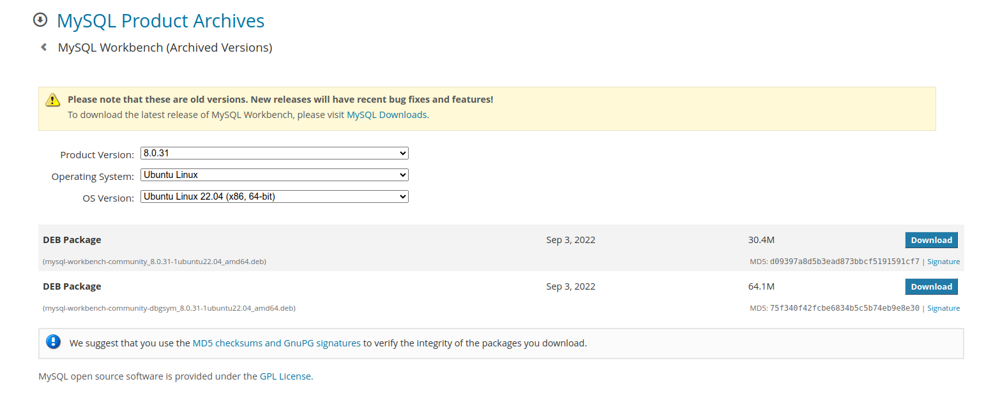

### MySql installation in Ubuntu 22.04

---

### Installing MySQL-Server:

```
sudo apt update

sudo apt install mysql-server

sudo systemctl start mysql.service

```

### Creating NEW_USER: 

* Syntax:

```
mysql> create user 'user_name@'localhost' identified by 'user_password';

```
* Example:

```
mysql> create user 'abhishek'@'localhost' identified by 'abhi1234';

```

### Granting All Privileges to the user:

* Syntax:

```
mysql> grant all privileges on *.* to 'user_name@'localhost';

```
* Example:

```

mysql> grant all privileges on *.* to 'abhishek'@'localhost';

```

### Login with NEW_USER:

* Syntax:

```
mysql -u user_name -p

```
* Example:

```

mysql -u abhishek -p

```

### Installing MySQL-Workbench

* Download debian package from the below link https://downloads.mysql.com/archives/workbench/

<p align="left">

</p>

* Install with downloaded debian package

```

sudo apt install ./mysql-workbench-community_8.0.31-1ubuntu22.04_amd64.deb 

```


## References:

1. https://www.digitalocean.com/community/tutorials/how-to-install-mysql-on-ubuntu-22-04
2. https://www.youtube.com/watch?v=EYc9DNYyiW4
3. https://dev.mysql.com/doc/workbench/en/wb-installing-linux.html#wb-installing-linux-installing-deb
